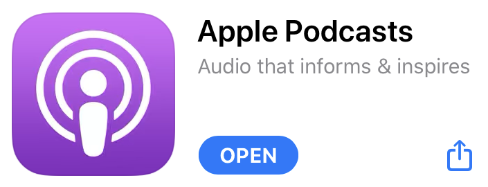
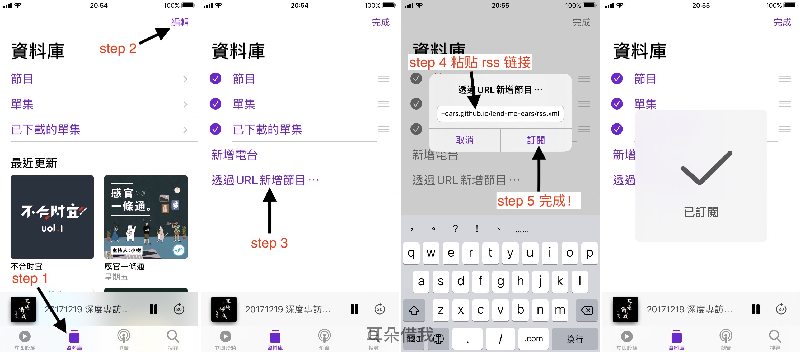

# 耳朵借我

此 Repo 为网友创建并维护，非官方，旨在为两岸三地的听众朋友提供便捷的收听方式。特别是为生活在大陆的朋友，提供 「无审查」、「免翻墙」、「期数齐全」的体验。


### 使用方法
复制以下 RSS 链接，用支持 RSS 的播客（podcast）App进行订阅收听。

```http
https://lend-me-ears.github.io/lend-me-ears/rss.xml
```

####  App 推荐

1. RadioPublic  ( iOS & Android )
2. Pocket Casts  ( iOS & Android )
3. AntennaPod （Android only）
4. Podkicker（Android only）

iOS 用户，推荐使用苹果自家的 Podcast App



##### 使用步骤





### 节目列表

更新至 2020/06/02，持续更新中...

#### 2020（目前 45 期）

#### 2019（共 105 期）

#### 2018（共 105 期，缺 2）

#### 2017（共 40 期）☑️


### 暂缺存档（后期会补上）

#### 2018

1. [1/22 耳朵借我：深度專訪柯智豪](https://medium.com/@mafang/1-22-耳朵借我-深度專訪柯智豪-f2a01ea4cbb1)      [Seven Wong@mixcloud](https://www.mixcloud.com/seven-wong/2018-01-22-耳朵借我-深度專訪柯智豪/) 
2. [1/29  耳朵借我：深度專訪陶喆](https://medium.com/@mafang/1-29-耳朵借我-深度專訪陶喆-4d77fd03a690)      [Seven Wong@mixcloud](https://www.mixcloud.com/seven-wong/2018-01-29-%E8%80%B3%E6%9C%B5%E5%80%9F%E6%88%91-%E6%B7%B1%E5%BA%A6%E5%B0%88%E8%A8%AA%E9%99%B6%E5%96%86)


### 计划 Todo List

2. 添加节目列表。
3. 补上缺少的存档。
4. 每一期根据马芳老师的 Blog，添加单期图片与文字介绍。
5. 坚持更新 XD


### 相关链接

1. 马芳老师 Blog：[Medium](https://medium.com/@mafang)
2. Facebook 社团：[耳朵借給馬世芳－電台靴腿小組](https://www.facebook.com/groups/258827734532615)
3. 原始音频档: [下载](https://cloud.lend-me-ears.workers.dev)  
4. [湾湾独立音乐速报](https://weibo.com/rebelfreak)，和你一样热爱台湾音乐！


### 联系

如有问题或者建议，请直接提 [issue](https://github.com/lend-me-ears/lend-me-ears/issues) 或发邮件至 lend.me.ears@gmail.com . 

